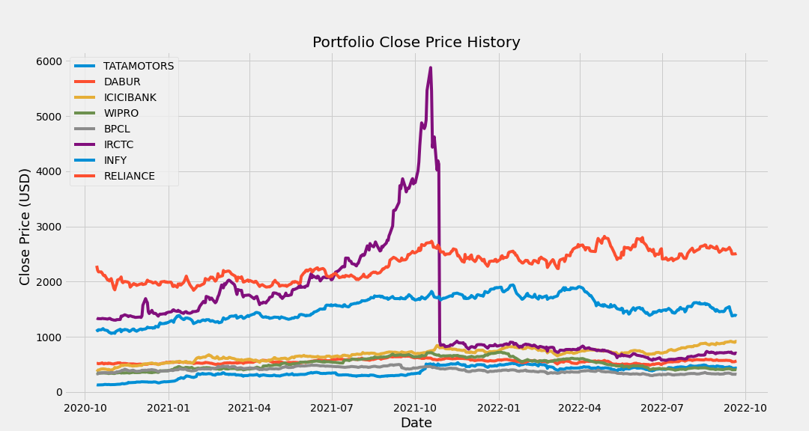
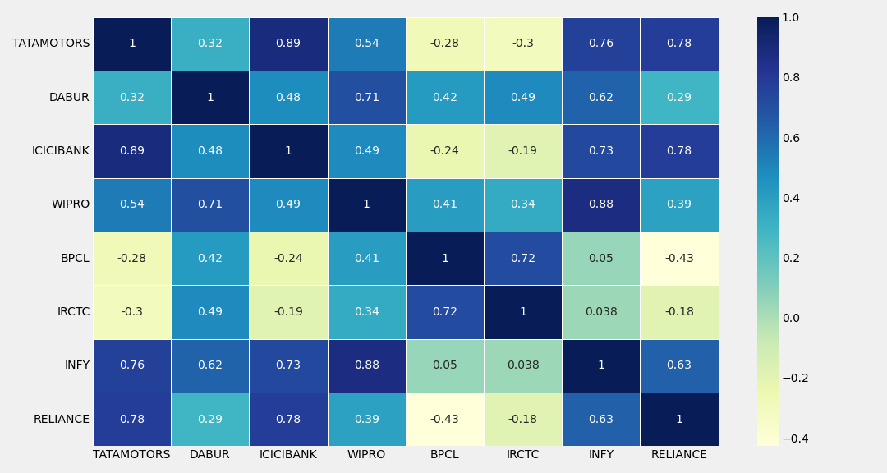
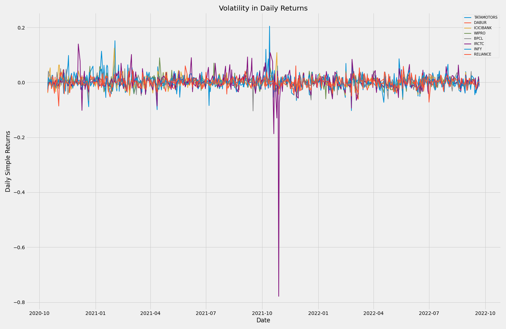
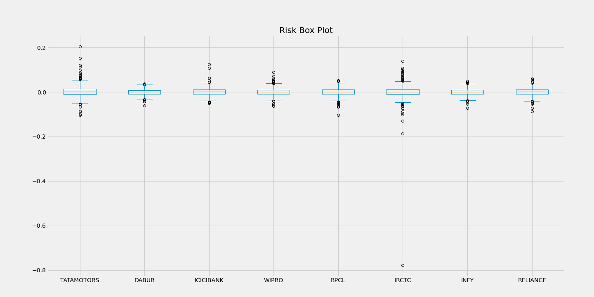
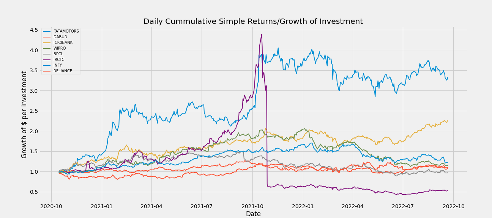

# Exploratory Data Analysis For Portfolio Optimisation
This project aims at building an optimal portfolio using analysis from historical data.

Portfolio Optimisation is the process of selecting the best asset distribution across a selection of assets from the range of other options, according to an objective. This objective typically maximizes factors such as expected return, and minimizes costs like financial risk. 

This project is based on the principle that investors should want the highest return for the lowest risk. To achieve this, assets in a portfolio should be selected after considering how they perform relative to each other, i.e., they should have a low correlation.

Optimisation is necessary for clients and investors looking towards maximizing the risk-return-trade-off since this process is targeted at maximizing the return for every additional unit of risk taken in the portfolio.

## Dataset 
The data used for this study is obtained from the [NSE Stock Exchange](https://www.nseindia.com/). The dataset time range is from 14th of October, 2020 to 21st of September, 2022 (2 years). Assets in the portfolio include: 

- **TATAMOTORS**: Tata Motors Limited is an Indian multinational automotive manufacturing company.
- **DABUR**: Dabur Ltd is an Indian multinational consumer goods company.
- **ICICBANK**: ICICI Bank Limited is an Indian multinational bank and financial services company.
- **WIPRO**: Wipro Limited is an Indian multinational corporation that provides information technology, consulting and business process services.
- **BPCL**: Bharat Petroleum Corporation Limited is an Indian government-owned oil and gas explorer and producer.
- **IRCTC**: Indian Railway Catering and Tourism Corporation is an Indian public sector undertaking that provides ticketing, catering, and tourism services for the Indian Railways.
- **INFY**: Infosys Limited is an Indian multinational information technology company that provides business consulting, information technology and outsourcing services. 
- **RELIANCE**: Reliance Industries Limited is an Indian multinational conglomerate company.  It has diverse businesses including energy, petrochemicals, natural gas, retail, telecommunications, mass media, and textiles.

## EDA Visualization

Last prices at the end of every day

 Portfolio Close Price History
 

A correlation matrix is a table showing correlation coefficients between variables. Each cell in the table shows the correlation between two variables. The correlation matrix will tell us the strength of the relationship between the stocks in our portfolio, which essentially can be used for effective diversification.

 Portfolio Diversification Matrix
 

Daily Simple Returns is essentially the percentage change in the Prices being calculated daily.

 Volatility Daily Returns
 

Risk using Daily Returns

 Risk using Daily Returns
 

The cumulative return is the total change in the investment price over a set time.

 Cummulative Daily Returns
 

## Conclusions:
- **IRCTC** contained some positive outliers affecting analysis, and had the largest spread.
- **Correlation Matrix** indicates the strength of the relationship between the stocks in the portfolio.
    - **WIPRO**/**BPCL** and **INFY**/**RELIANCE** are good investments, considering portfolio diversification. If either of moves them in one direction, there's a less chance of the other also moving in the same direction.
    - **Diversification** can help reduce the portfolio's risk so that one asset or asset class's performance doesn't affect the entire portfolio.

 - **Sharpe Ratio** indicates how much return is received for the volatility of holding a riskier asset. 
     - **TATAMOTORS** had the best risk-to-return ratio. 
    - **BPCL** permfomed the least.

- Generally, 
    - **TATAMOTORS** was the best performing stock across the 2-year period.

## Acknowledgemnts
If this repository has been useful to you, please leave it a star. If you want to contact me, try [Twitter](https://twitter.com/manuelinfosec/)